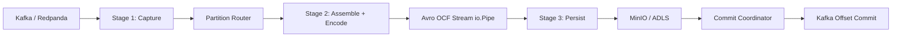
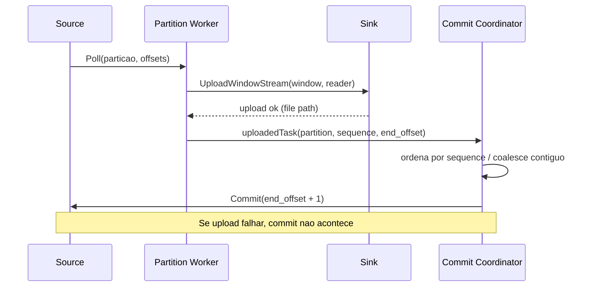

# Data Ingestion Runtime

Runtime em Go para ingestao Kafka/Redpanda -> Landing Zone, com foco em throughput, previsibilidade e seguranca de offset commit.

## Objetivo do motor

Este conector existe para capturar dados da origem o mais rapido possivel e persistir em landing raw append-only (WAL-like), sem transformar semanticamente o payload.

Principios:

- landing e raw: sem deduplicacao, sem enriquecimento, sem modelagem analitica
- payload segue fiel ao Kafka
- commit de offset acontece somente apos persistencia remota bem-sucedida
- Bronze/Delta e responsabilidade de etapa posterior (fora deste runtime)

## Pipeline em 3 etapas

### Etapa 1: Capture (Kafka Source)

Responsabilidades:

- consumir mensagens por particao via `franz-go`
- aplicar tuning de fetch/poll
- montar `KafkaMessage` tecnico (topic/partition/offset/key/headers/schema id/payload)
- entregar mensagens para workers de particao

Arquivos:

- `internal/adapters/source/kafka/source.go`
- `internal/core/ports.go` (`Source`)

### Etapa 2: Assemble + Encode (Hot Path)

Responsabilidades:

- agregar janela por particao (`BatchWindow` + ranges de offset)
- converter `KafkaMessage` em `LandingRecord`
- serializar incrementalmente em Avro OCF no stream (`io.Pipe`)
- controlar concorrencia de encode/flush com backpressure

Arquivos:

- `internal/batch/assembler.go`
- `internal/adapters/sink/fileformat/tempfile.go` (somente stream writer; sem temp file)
- `internal/adapters/sink/avroutil/writer.go`
- `internal/model/record.go`
- `internal/app/runner.go`

### Etapa 3: Persist + Commit (Sink + Coordinator)

Responsabilidades:

- upload streaming para MinIO/ADLS
- coordenar commit em ordem por particao
- coalescer lotes contiguos quando possivel
- nunca comitar lote com falha de upload

Arquivos:

- `internal/adapters/sink/minio/sink.go`
- `internal/adapters/sink/adls/sink.go`
- `internal/adapters/sink/pathing/pathing.go`
- `internal/app/runner.go` (`runCommitCoordinator`)
- `internal/core/ports.go` (`Sink`)

## Diagrama de alto nivel



## Diagrama de commit safety



## Mapa dos modulos

- `cmd/landing-connector`: entrypoint, signal handling, timeout e pprof
- `internal/config`: parser YAML, defaults, validacao e host profile auto defaults
- `internal/core`: portas (`Source`, `Sink`) e factories
- `internal/adapters/source/kafka`: consumo e commit Kafka
- `internal/adapters/sink/*`: persistencia em MinIO/ADLS + path deterministico
- `internal/batch`: montagem da janela e metadados de flush
- `internal/app`: orchestrator do runtime, concorrencia, autotune e commit coordinator
- `internal/model`: contratos tecnicos (`KafkaMessage`, `LandingRecord`, `BatchWindow`)

## Como o runtime executa

1. carrega config e aplica defaults auto-tuned quando campos estao em `0`
2. inicializa source e sink via factory
3. inicia loop de poll e roteia mensagens por particao
4. cada worker de particao escreve Avro incremental em stream
5. ao fechar janela, dispara upload streaming
6. commit coordinator recebe lotes persistidos e comita em ordem
7. ao encerrar, emite runtime stats (heap/gc/alloc rate)

## Autotune atual (estado do motor)

O runtime possui dois niveis de ajuste:

- bootstrap por host profile (CPU/RAM):
  - `poll_records`, `fetch_*`, paralelismo inicial e tamanhos de fila
- controle em runtime (`autotune_mode: auto`):
  - ajusta `poll_limit` por janela
  - aplica guardrails de memoria/GC
  - teto dinamico de workers limitado por particoes ativas observadas e `autotune_max_workers`

Knobs centrais em `runtime`:

- `max_parallel_flushes`
- `max_parallel_encodes`
- `max_parallel_uploads`
- `flush_queue_size`
- `partition_queue_size`
- `execution_mode` (`auto|finite|continuous`)
- `autotune_mode` (`auto|off`)
- `autotune_interval`
- `autotune_max_workers`
- `autotune_poll_max`
- `drain_idle_poll_count`
- `idle_poll_timeout`

## Configuracao de referencia

Arquivos exemplo:

- [configs/orders.minio.example.yaml](configs/orders.minio.example.yaml)
- [configs/orders.example.yaml](configs/orders.example.yaml)

Pontos importantes:

- `kafka.commit_interval` deve ser `0s` (commit manual seguro do runtime)
- `output.format` atual suportado: `avro`
- `output.compression` suportado: `null|snappy|deflate`
- `multipart_part_size_mib` controla comportamento de upload no MinIO streaming

## Execucao local

Subir stack local:

- [deploy/docker-compose.local.yml](deploy/docker-compose.local.yml)
- Redpanda Console: `http://localhost:8080`
- MinIO Console: `http://localhost:9001`

Rodar runtime:

```bash
go run ./cmd/landing-connector -config ./configs/orders.minio.example.yaml
```

## Observabilidade

Logs por batch incluem:

- throughput e tamanho (`records`, `approx_input_bytes`, `stream_size`)
- tempos (`encode_duration`, `upload_duration`, `upload_active_duration`, `time_to_commit`)
- sinais de gargalo (`upload_wait_for_first_byte`, `upload_tail_finalize_duration`)
- memoria/gc (`heap_alloc_bytes`, `heap_sys_bytes`, `gc_cycles`, `gc_pause_total_ns`)

Ao final do run:

- `runtime stats` com alloc rate, heap, goroutines e delta de GC

## O que o runtime NAO faz

- nao transforma para Bronze/Delta
- nao parseia payload semanticamente
- nao deduplica
- nao implementa semantica de upsert

## Documentacao complementar

- [docs/architecture/README.md](docs/architecture/README.md)
- [docs/architecture/current-connector-flow.md](docs/architecture/current-connector-flow.md)
- [docs/architecture/performance-analysis.md](docs/architecture/performance-analysis.md)
- [docs/architecture/performance-deep-dive-2026-04-28.md](docs/architecture/performance-deep-dive-2026-04-28.md)
- [scripts/bench/run-local-compression-matrix.sh](scripts/bench/run-local-compression-matrix.sh)
- [scripts/bench/run-avro-e2e-matrix.sh](scripts/bench/run-avro-e2e-matrix.sh)
