# Fluxo Atual do Conector

Este documento descreve o fluxo atual do runtime apos a convergencia para o write path `avro`.

## Visao Geral

O conector:

1. abre um consumer Kafka com commit manual
2. faz `poll` em blocos
3. roteia mensagens para workers por particao
4. cada worker monta a janela de batch
5. cada mensagem e codificada incrementalmente em Avro OCF para um arquivo temporario
6. quando a janela fecha, o arquivo e enviado ao sink
7. o commit ocorre somente depois do upload bem-sucedido

## Diagrama

```mermaid
flowchart LR
    A["Kafka / Redpanda"] --> B["Kafka Source"]
    B --> C["Partition Router"]
    C --> D["Partition Worker"]
    D --> E["Batch Assembler"]
    E --> F["Avro Stream Writer"]
    F --> G["Temp File"]
    G --> H["Sink Upload Worker"]
    H --> I["MinIO / ADLS"]
    I --> J["Commit Coordinator"]
    J --> K["Kafka Offset Commit"]
```

## Semantica

- landing raw, append-only e WAL-like
- sem deduplicacao
- sem parsing pesado do payload
- sem transformacao semantica para Bronze/Delta
- commit somente apos persistencia remota confirmada
- ordem de commit preservada por particao

## Controles de Concorrencia

- `runtime.max_parallel_flushes`
  limita quantas janelas podem ficar em voo do fechamento ate o commit
- `runtime.max_parallel_encodes`
  limita a concorrencia da etapa quente de encode local
- `runtime.max_parallel_uploads`
  define quantos uploads podem acontecer em paralelo
- `runtime.partition_queue_size`
  define o buffer por particao antes de aplicar backpressure

## Observabilidade

O conector registra por janela:

- `records`
- `bytes_approx`
- `records_per_sec`
- `bytes_per_sec`
- `assembly_duration`
- `upload_duration`
- `time_to_commit`

Ao final da execucao ele tambem registra:

- `heap_alloc_bytes`
- `heap_inuse_bytes`
- `heap_sys_bytes`
- `total_alloc_bytes`
- `alloc_delta_bytes`
- `alloc_rate_bytes_per_sec`
- `gc_cycles`
- `gc_pause_total_ns`

## Limitacao Atual

O arquivo ainda e materializado localmente antes do upload. Isso continua sendo o desenho mais seguro porque o path final depende da faixa de offsets da janela. Um upload streaming direto para o nome final exigiria mudar a semantica de nomeacao ou adicionar renomeacao/copia remota.
