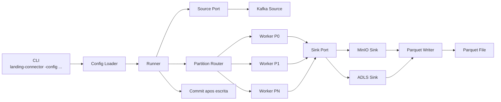
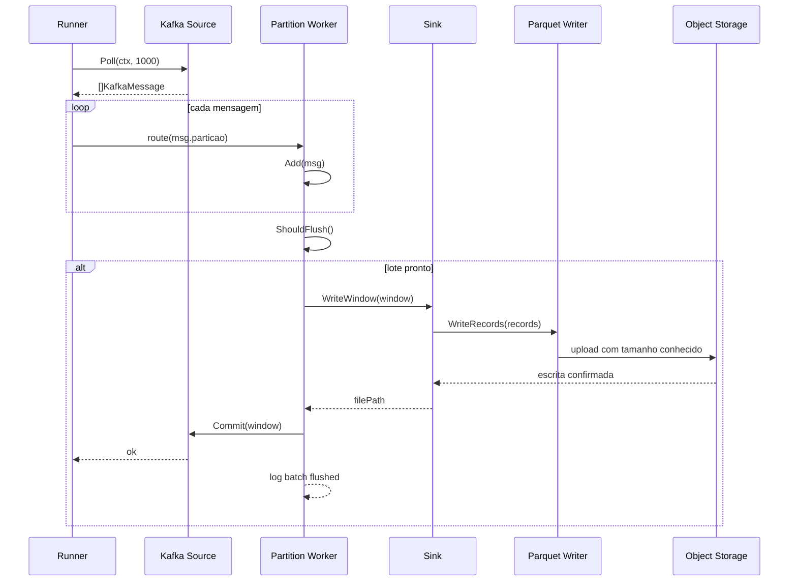
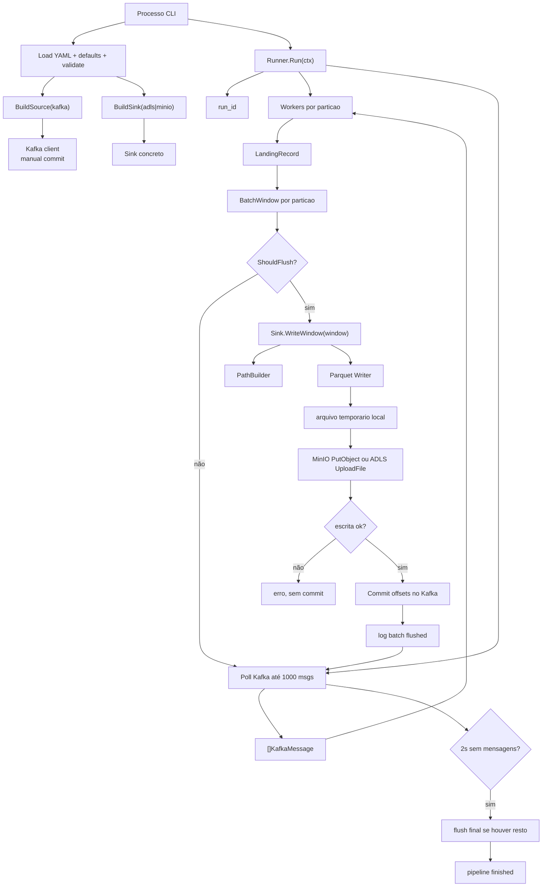

# Fluxo Atual do Conector

Este documento descreve em profundidade como o conector funciona hoje no repositório, do ponto de entrada da aplicacao ate a leitura no Kafka, montagem do lote, serializacao em Parquet, escrita no sink e commit dos offsets.

O objetivo aqui e documentar o comportamento real do codigo atual, inclusive as caracteristicas operacionais e as limitacoes do desenho presente.

## Visao Geral

Hoje o conector e um processo batch disparado por linha de comando, com flush assincrono controlado por particao.

Ele:

1. recebe um arquivo YAML de configuracao
2. abre um consumidor Kafka com commit manual
3. le mensagens em blocos
4. roteia as mensagens para workers por particao
5. cada worker transforma suas mensagens em um `BatchWindow`
6. serializa esse lote para Parquet
7. grava o arquivo no sink configurado
8. so depois faz o commit dos offsets da particao correspondente

A implicacao arquitetural mais importante e:

- a semantica atual e `at-least-once`

O ponto de entrada esta em [main.go](../../cmd/landing-connector/main.go).
A montagem dos adapters acontece em [factory.go](../../internal/core/factory.go).
A orquestracao principal esta em [runner.go](../../internal/app/runner.go).

## Desenho Logico

## 1. Inicializacao do Processo

O binario comeca lendo o argumento `-config` em [main.go](../../cmd/landing-connector/main.go).

Fluxo:

1. valida se `-config` foi informado
2. cria logger com `zap`
3. carrega a configuracao YAML
4. cria um `context.Context` cancelavel por `SIGINT` e `SIGTERM`
5. aplica `run_timeout`, se configurado
6. monta o `Runner`
7. executa `runner.Run(ctx)`

Trechos principais:

- [main.go](../../cmd/landing-connector/main.go:18)
- [main.go](../../cmd/landing-connector/main.go:26)
- [main.go](../../cmd/landing-connector/main.go:38)
- [main.go](../../cmd/landing-connector/main.go:41)
- [main.go](../../cmd/landing-connector/main.go:47)

O processo pode terminar por tres motivos principais:

- sinal do sistema operacional
- timeout configurado
- esgotamento natural do backlog, detectado pelo `Runner`

## 2. Configuracao

A configuracao e carregada em [config.go](../../internal/config/config.go).

O loader faz:

1. `os.ReadFile`
2. `yaml.Unmarshal`
3. `applyDefaults`
4. `Validate`

Trecho principal:

- [config.go](../../internal/config/config.go:87)

### Estrutura da configuracao

O objeto principal `Config` contem:

- `pipeline_id`
- `run_timeout`
- `source`
- `sink`
- `kafka`
- `batch`
- `adls`
- `minio`
- `output`
- `runtime`

Veja:

- [config.go](../../internal/config/config.go:13)

### Defaults aplicados

Defaults mais importantes:

- `source.type = kafka`
- `sink.type = adls`
- `output.parquet_compression = zstd`
- `output.file_prefix = part`
- `adls.credential.mode = default_azure_credential`
- `runtime.max_parallel_flushes = min(GOMAXPROCS, 4)`
- `runtime.partition_queue_size = max_parallel_flushes * 2`
- `runtime.pprof_addr = 127.0.0.1:6060`

Trecho:

- [config.go](../../internal/config/config.go:107)

### Validacoes importantes

Validacoes relevantes para o comportamento arquitetural:

- `pipeline_id` e obrigatorio
- `kafka.brokers`, `kafka.topic` e `kafka.consumer_group` sao obrigatorios
- `batch.max_records`, `batch.max_bytes` e `batch.max_duration` devem ser positivos
- `runtime.max_parallel_flushes` e `runtime.partition_queue_size` devem ser positivos
- `output.parquet_compression` deve ser um codec suportado
- `sink.type` deve ser `adls` ou `minio`
- `kafka.commit_interval` deve ser `0`

Trecho:

- [config.go](../../internal/config/config.go:131)

Essa ultima regra e central:

- o conector nao usa commit automatico
- offsets so sao commitados depois da escrita confirmada no sink

## 3. Portas e Adapters

O projeto segue um desenho simples de arquitetura hexagonal.

As portas estao em [ports.go](../../internal/core/ports.go):

- `Source`
- `Sink`

Trecho:

- [ports.go](../../internal/core/ports.go:9)

Contrato atual:

- `Source.Poll`
- `Source.Commit`
- `Source.Close`
- `Sink.WriteWindow`

A escolha do adapter concreto e feita em [factory.go](../../internal/core/factory.go):

- `BuildSource` hoje monta o adapter Kafka
- `BuildSink` monta `adls` ou `minio`

Trecho:

- [factory.go](../../internal/core/factory.go:14)

## 4. Orquestracao Principal no Runner

O `Runner` e o cerebro da execucao atual.

Ele vive em [runner.go](../../internal/app/runner.go) e guarda:

- `cfg`
- `logger`
- `source`
- `sink`

Trecho:

- [runner.go](../../internal/app/runner.go:16)

Quando `Run` comeca:

1. fecha o `source` no final
2. gera um `runID` UTC com nanossegundos
3. registra `pipeline started`
4. cria estruturas de workers por particao
5. cria um limitador global de flush concorrente
6. entra no loop de `poll -> route -> flush`

Trechos:

- [runner.go](../../internal/app/runner.go:45)
- [runner.go](../../internal/app/runner.go:48)
- [runner.go](../../internal/app/runner.go:55)

### Inatividade e encerramento

O `Runner` usa:

- `idlePollTimeout = 2 * time.Second`

Trecho:

- [runner.go](../../internal/app/runner.go:23)

No loop:

- ele cria um `pollCtx` com timeout de 2 segundos
- chama `source.Poll(pollCtx, 1000)`
- se vier `context.DeadlineExceeded` e o contexto principal ainda estiver vivo, ele interpreta isso como ausencia de mensagens e encerra a execucao

Isso significa que o comportamento operacional atual e:

- o conector sobe
- drena o backlog
- se passar 2 segundos sem mensagens, encerra

Ele nao foi desenhado hoje como um consumer continuo que fica rodando indefinidamente.

### Concorrencia atual

O `Runner` nao e mais totalmente serial.

Hoje ele:

- continua fazendo `Poll` enquanto houver espaco nas filas por particao
- preserva ordem dentro de cada particao
- limita o numero global de flushes com `runtime.max_parallel_flushes`
- aplica backpressure com `runtime.partition_queue_size`

## 5. Leitura no Kafka

O adapter Kafka esta em [source.go](../../internal/adapters/source/kafka/source.go).

Na criacao do cliente, ele configura:

- brokers
- topic
- consumer group
- `DisableAutoCommit()`

Trecho:

- [source.go](../../internal/adapters/source/kafka/source.go:21)

Configuracoes adicionais:

- `client_id`, se vier no YAML
- TLS opcional
- SASL PLAIN opcional

### Poll

O metodo `Poll`:

- chama `PollRecords(ctx, limit)`
- converte os registros em `model.KafkaMessage`
- copia `headers`
- preserva `topic`, `partition`, `offset`, `timestamp`, `key` e `value`

Trecho:

- [source.go](../../internal/adapters/source/kafka/source.go:61)

No `Runner`, o limite passado para leitura e:

- `1000`

Trecho:

- [runner.go](../../internal/app/runner.go:63)

### Schema ID

O adapter tenta extrair `schema_id` a partir do payload usando a convencao de serializacao com magic byte inicial `0`.

Trecho:

- [source.go](../../internal/adapters/source/kafka/source.go:109)

### Commit

O commit e manual e acontece por particao.

Para cada particao do lote, o conector commita:

- `EndOffset + 1`

Trecho:

- [source.go](../../internal/adapters/source/kafka/source.go:90)

Esse e o comportamento esperado no Kafka: o offset commitado representa o proximo offset a ser lido.

## 6. Montagem do Lote

A montagem do batch acontece em [assembler.go](../../internal/batch/assembler.go).

Cada worker de particao tem seu proprio `Assembler`, que guarda:

- `cfg`
- `runID`
- `startedAt`
- `window`

Trecho:

- [assembler.go](../../internal/batch/assembler.go:13)

O `window` interno e um `model.BatchWindow`, que contem:

- `RunID`
- `StartedAt`
- `EndedAt`
- `Records`
- `OffsetsByPart`
- `BytesApprox`

Modelo:

- [record.go](../../internal/model/record.go:17)

### Conversao de mensagem para LandingRecord

Cada mensagem Kafka vira um `LandingRecord` com:

- `ingestion_time`
- `run_id`
- `topic`
- `partition`
- `offset`
- `event_time`
- `key_raw`
- `headers_json`
- `schema_id`
- `payload_raw`

Trechos:

- [assembler.go](../../internal/batch/assembler.go:33)
- [record.go](../../internal/model/record.go:5)

### Como o payload e preservado

O `Assembler` nao tenta mais validar nem reinterpretar o payload no caminho quente.

Ele:

- copia o `[]byte` recebido do Kafka
- preserva o valor em `payload_raw`
- evita conversao obrigatoria para `string`

Portanto, a landing atual e orientada a preservacao bruta do evento para materializacao posterior na Bronze.

### Inclusao de key e headers

Se `include_key` estiver ativo:

- a chave vira `key_raw`

Se `include_headers` estiver ativo:

- os headers viram um JSON serializado em `headers_json`

Trechos:

- [assembler.go](../../internal/batch/assembler.go:52)
- [assembler.go](../../internal/batch/assembler.go:56)

### Controle de offsets por particao

O `Assembler` tambem mantem, para cada particao:

- `StartOffset`
- `EndOffset`
- `RecordCount`

Trecho:

- [assembler.go](../../internal/batch/assembler.go:72)

Isso serve para:

- commit posterior
- nome do arquivo
- rastreabilidade do lote

### Regra de flush

O lote fecha quando qualquer uma das tres condicoes dispara:

- `max_records`
- `max_bytes`
- `max_duration`

Trecho:

- [assembler.go](../../internal/batch/assembler.go:89)

Isso e um `OR`, nao um `AND`.

## 7. Semantica do Loop do Runner

O fluxo do loop principal e:

1. `Poll` no Kafka
2. roteamento por particao
3. `Add` no assembler da particao
4. `ShouldFlush`
5. se o lote estiver pronto, chamar `flush`
6. se nao houver mais mensagens por 2 segundos, sair
7. fechar filas e fazer flush final do que restou em cada particao

Trechos:

- [runner.go](../../internal/app/runner.go:57)
- [runner.go](../../internal/app/runner.go:76)
- [runner.go](../../internal/app/runner.go:89)

Importante:

- o `Runner` preserva ordem por particao
- o flush pode acontecer em paralelo entre particoes
- o commit continua vindo somente depois da escrita do lote
- o backpressure impede crescimento descontrolado de memoria

Isso e uma das caracteristicas mais importantes do desempenho atual.

## 8. Escrita no Sink e Commit

O metodo `flush` do runner faz:

1. adquire um slot no limitador global de flush
2. materializa o `window`
3. chama `sink.WriteWindow`
4. chama `source.Commit`
5. registra log `batch flushed`

Trecho:

- [runner.go](../../internal/app/runner.go:102)

Essa ordem define toda a semantica de entrega do sistema.

### Semantica de entrega atual

Hoje o conector opera em:

- `at-least-once`

Porque:

- se a escrita falhar, nao ha commit
- se a escrita for concluida e o processo falhar antes do commit, o mesmo lote pode ser relido no futuro

Ou seja:

- o sistema privilegia nao perder dado
- duplicidade eventual na landing e aceita

## 9. Nome do Arquivo Gerado

O path do arquivo e montado em [pathing.go](../../internal/adapters/sink/pathing/pathing.go).

Estrutura:

- `base_path`
- `dt=YYYY-MM-DD`
- `hr=HH`
- `part-<run_id>-<ranges_por_particao>.parquet`

Trecho:

- [pathing.go](../../internal/adapters/sink/pathing/pathing.go:10)

Os ranges por particao sao ordenados antes de montar o nome do arquivo.

Isso faz com que o nome do objeto carregue metadados uteis de auditoria:

- quais particoes entraram no lote
- de qual offset ate qual offset

## 10. Serializacao para Parquet

A serializacao esta em [writer.go](../../internal/adapters/sink/parquetutil/writer.go).

O writer escolhe uma struct diferente dependendo do codec configurado:

- `uncompressed`
- `snappy`
- `gzip`
- `brotli`
- `lz4`
- `zstd`

Trecho:

- [writer.go](../../internal/adapters/sink/parquetutil/writer.go:93)

### Como ele escreve hoje

No estado atual do repositorio:

- `WriteRecords` recebe um `io.Writer`
- ele escreve em chunks de `1024` registros
- usa `parquet.NewGenericWriter[T](output)`

Trechos:

- [writer.go](../../internal/adapters/sink/parquetutil/writer.go:91)
- [writer.go](../../internal/adapters/sink/parquetutil/writer.go:190)

Fluxo conceitual:

1. recebe `[]LandingRecord`
2. escolhe o struct compatível com o codec
3. cria sub-lotes de `1024`
4. mapeia cada sub-lote para o tipo Parquet correspondente
5. grava esse sub-lote
6. fecha o writer ao final

## 11. Sink MinIO

O sink MinIO esta em [minio/sink.go](../../internal/adapters/sink/minio/sink.go).

Fluxo:

1. monta o `objectPath`
2. materializa o Parquet em arquivo temporario local
3. descobre o tamanho real do arquivo
4. chama `PutObject` com tamanho conhecido

Trecho:

- [minio/sink.go](../../internal/adapters/sink/minio/sink.go:53)

Isso significa que, no estado atual, o sink MinIO privilegia upload com tamanho conhecido para evitar o custo de `PutObject(..., -1)`.

## 12. Sink ADLS

O sink ADLS esta em [adls/sink.go](../../internal/adapters/sink/adls/sink.go).

Fluxo:

1. monta o `filePath`
2. cria o arquivo no ADLS
3. materializa o Parquet em arquivo temporario local
4. chama `UploadFile`

Trecho:

- [adls/sink.go](../../internal/adapters/sink/adls/sink.go:42)

Diferenca importante em relacao ao MinIO:

- no ADLS, o arquivo remoto continua sendo criado explicitamente antes do upload

## 13. Sequencia Completa de Execucao

## 14. Fluxo Completo do Estado Atual

## 15. Caracteristicas Operacionais Mais Importantes

Hoje o conector e:

- batch orientado a drenagem de backlog
- concorrente por particao com backpressure
- baseado em commit manual no Kafka
- `at-least-once`
- orientado a gerar arquivos Parquet por janela

Em uma frase:

- o conector atual sobe, drena o backlog do topico, roteia eventos para workers por particao, grava um arquivo Parquet por lote no sink e so depois confirma os offsets no Kafka

## 16. Limitacoes Estruturais do Desenho Atual

As principais limitacoes atuais sao:

- o paralelismo ainda e limitado por numero de particoes e por `max_parallel_flushes`
- o commit depende totalmente da conclusao da escrita do sink
- a validacao e transformacao do payload ainda acontecem no caminho quente
- a semantica `at-least-once` permite duplicidade eventual na landing

Esses pontos explicam tanto o comportamento operacional quanto boa parte dos gargalos de performance observados nos benchmarks.
