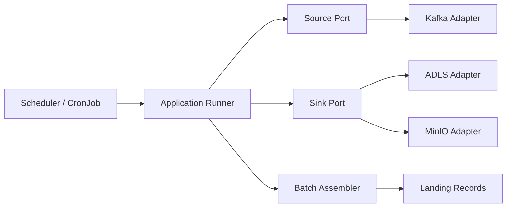

# Visao do Sistema

## Contexto

A solucao processa dados em batches a partir de uma origem de eventos e os grava em uma landing zone object storage. O primeiro caso de uso e:

- origem: Kafka
- destino de producao: ADLS Gen2
- destino de teste local: MinIO
- formato: Avro OCF com compressao Snappy
- payload: bruto, preservado em `payload_raw`

## Desenho logico

## Responsabilidades

### `internal/app`

- orquestra o caso de uso
- controla ciclo de vida da execucao
- coordena leitura, flush e commit

### `internal/core`

- define as portas `Source` e `Sink`
- monta adapters por configuracao

### `internal/adapters/source`

- implementa leitura de tecnologias concretas
- primeiro adapter: Kafka

### `internal/adapters/sink`

- implementa escrita em tecnologias concretas
- primeiros adapters: ADLS e MinIO

### `internal/batch`

- transforma mensagens de origem em `LandingRecord`
- aplica politica de flush por tempo, bytes e numero de registros

### `internal/model`

- define os contratos tecnicos internos

## Contrato atual da landing

- `ingestion_time`
- `run_id`
- `topic`
- `partition`
- `offset`
- `event_time`
- `key_raw`
- `headers_json`
- `schema_id`
- `payload_raw`

## Semantica

- entrega `at-least-once`
- commit de offset somente apos escrita confirmada no sink
- duplicidade eventual e tratada como aceitavel na landing
